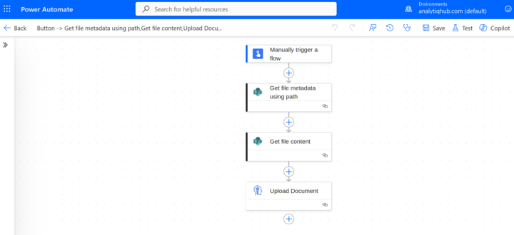
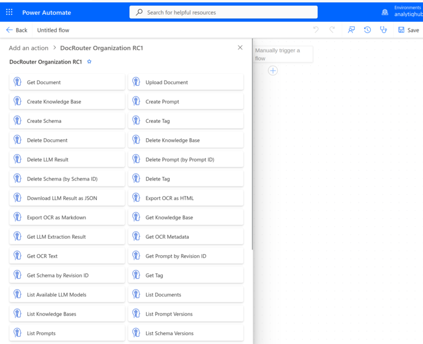

# power-automate-docrouter

Microsoft Power Automate tooling for [DocRouter.ai](https://docrouter.ai): the **DocRouter Organization RC1** custom connector (organization-scoped HTTP API under `/v0/orgs/...`) and the **DocRouter Account** custom connector (account-scoped APIs under `/v0/account/...`: users, organizations, tokens, AWS and LLM configuration).

## Sandbox sample flow

The **sandbox** is a minimal Power Automate flow that proves end-to-end file ingestion: read a file from **SharePoint** (or any source that exposes a name + Base64 content) and send it to DocRouter with **Upload Document**. It is not a separate product—just a reference pattern you can copy.

Typical sequence:

1. **Manually trigger a flow** — run on demand while you test.
2. **Get file metadata using path** — resolves the file in a library (name, path, identifiers); the screenshot uses SharePoint.
3. **Get file content** — loads the file bytes for the next step.
4. **Upload Document** (DocRouter Organization RC1) — maps **File name** → `document_name` and **File content** → `content`, then runs OCR/LLM processing on the DocRouter side.



The same connector exposes the full org API (documents, tags, prompts, schemas, knowledge bases, OCR/LLM helpers, webhooks, and more). The action picker shows everything available under **DocRouter Organization RC1**:



## Installing the connector

You need the [Power Platform CLI connector tools](https://learn.microsoft.com/en-us/connectors/custom-connectors/) (`paconn`), a Python 3 environment, and rights to create custom connectors in your Power Platform **environment**.

### 1. Clone and Python environment

```bash
cd power-automate-docrouter
python -m venv .venv
source .venv/bin/activate   # Windows: .venv\Scripts\activate
pip install -r requirements.txt
```

This installs `paconn`.

### 2. Sign in to Power Platform

From the repo root:

```bash
./login.sh
```

Or: `paconn login` after activating the venv. Complete the browser/device login for the tenant where the connector should live.

To clear stored credentials: `./logout.sh` (or `paconn logout`).

### 3. Create a connector (first time)

**Organization connector** (documents, prompts, org APIs):

```bash
./docrouter/docrouter-org/create.sh
```

`paconn` registers the connector using `docrouter/docrouter-org/apiDefinition.swagger.json`, `apiProperties.json`, `icon.png`, and `script.csx` (injects organization id into `/v0/orgs/...` paths).

**Account connector** (users, organizations, account tokens, AWS, LLM providers — no script):

```bash
./docrouter/docrouter-account/create.sh
```

Uses `docrouter/docrouter-account/apiDefinition.swagger.json`, `apiProperties.json`, and `icon.png` only.

Each `create.sh` run prints the new **connector id** on stdout and suggests `ORG_CONNECTOR_ID` / `ACCOUNT_CONNECTOR_ID` for your repo-root `.env` (it also writes `settings.json` in that connector folder via `paconn --overwrite-settings`). You can also copy the id from **Data** → **Custom connectors** in Power Automate.

### 4. Update an existing connector

Set the connector id, then run `update.sh` for the connector you are refreshing:

```bash
export ORG_CONNECTOR_ID='shared_your-organization-connector-id-here'
export ACCOUNT_CONNECTOR_ID='shared_your-account-connector-id-here'
# or add ORG_CONNECTOR_ID / ACCOUNT_CONNECTOR_ID to a repo-root `.env` file
./docrouter/docrouter-org/update.sh
# or
./docrouter/docrouter-account/update.sh
```

You can also pass the id as the first argument:

```bash
./docrouter/docrouter-org/update.sh 'shared_your-organization-connector-id'
./docrouter/docrouter-account/update.sh 'shared_your-account-connector-id'
```

Optional: use a per-connector `settings.json` under `docrouter/docrouter-org/` or `docrouter/docrouter-account/` with `paconn update --settings ...` if you rely on saved paths (see Microsoft’s `paconn` documentation).

### 5. Use the connectors in a flow

In Power Automate, add an action from **DocRouter Organization RC1** and create a **connection** when prompted:

| Field | Purpose |
|--------|--------|
| **Base URL** | Optional. Default production API is used if blank (`https://app.docrouter.ai/fastapi`). |
| **Organization ID** | Your org segment from the DocRouter app URL (`.../orgs/{organization_id}/...`) or **Settings → Organization**. |
| **Organization Token** | API key from DocRouter **Settings → Developer** (sent as `X-Api-Key`). |

After the connection succeeds, you can build flows such as the sandbox above or call **Get Document**, **List Documents**, tags, prompts, and the rest of the operations shown in the action list screenshot.

#### DocRouter Account connection

When you add an action from **DocRouter Account**, create a **connection** with:

| Field | Purpose |
|--------|--------|
| **Base URL** | Optional. Default production API if blank (`https://app.docrouter.ai/fastapi`). |
| **Account API token** | Account-level token (`acc_...`) from DocRouter **Settings → Developer**. Organization tokens (`org_...`) do not work for `/v0/account/` APIs. |

### Alternative: import in the portal

You can also create or refresh a custom connector manually in [Power Automate](https://make.powerautomate.com) or the Power Platform portal by importing the same OpenAPI (`apiDefinition.swagger.json`), properties (`apiProperties.json`), icon, and (for the organization connector only) the C# script—`paconn` is the supported path for keeping this repo and the tenant in sync.

## Operations and parameters

### Organization connector

The tables below mirror `docrouter/docrouter-org/apiDefinition.swagger.json`. Every HTTP operation lives under `/v0/orgs/{organization_id}/...`. The **`organization_id`** path segment is **not** filled in per action in the designer: it is injected from the **connection** (see `script.csx` and `apiProperties.json`). Query and path parameters marked **internal** or **advanced** in the spec may be hidden or collapsed in the UI.

In **Body** rows, a trailing `*` on a property name (for example `name*`) means **required** in the JSON body.

### Documents

| Summary | Operation ID | HTTP | Parameters (excluding `organization_id`) |
|---------|--------------|------|------------------------------------------|
| Delete Document | `DeleteDocument` | DELETE | `document_id` (path, string, req) |
| Get Document | `GetDocument` | GET | `document_id` (path, string, req)<br>`include_content` (query, boolean, opt, advanced) |
| List Documents | `ListDocuments` | GET | `skip` (query, integer, opt, advanced)<br>`limit` (query, integer, opt, advanced)<br>`tag_ids` (query, string, opt, advanced)<br>`name_search` (query, string, opt, advanced) |
| Update Document Metadata | `UpdateDocument` | PUT | `document_id` (path, string, req)<br>**Body** (`DocumentUpdate`): `document_name`, `metadata` (JSON string), `tag_ids` |
| Upload Document | `UploadDocument` | POST | **Body** (`DocumentUpload`): `content`* (string, byte / Base64), `document_name`*, `metadata` (JSON string), `tag_ids` |

### Knowledge Bases

| Summary | Operation ID | HTTP | Parameters (excluding `organization_id`) |
|---------|--------------|------|------------------------------------------|
| Create Knowledge Base | `CreateKnowledgeBase` | POST | **Body** (`KnowledgeBaseConfig`): `name`*; `description`, `embedding_model`, `system_prompt`, `tag_ids` |
| Delete Knowledge Base | `DeleteKnowledgeBase` | DELETE | `kb_id` (path, string, req) |
| Get Knowledge Base | `GetKnowledgeBase` | GET | `kb_id` (path, string, req) |
| List Knowledge Bases | `ListKnowledgeBases` | GET | `name_search`, `skip`, `limit` (query, opt, advanced) |
| Reconcile Knowledge Base | `ReconcileKnowledgeBase` | POST | `kb_id` (path, string, req) |
| Search Knowledge Base | `SearchKnowledgeBase` | POST | `kb_id` (path, string, req)<br>**Body** (`KBSearchRequest`): `query`*; `metadata_filter`, `top_k` |
| Update Knowledge Base | `UpdateKnowledgeBase` | PUT | `kb_id` (path, string, req)<br>**Body** (`KnowledgeBaseConfig`): `name`*; `description`, `embedding_model`, `system_prompt`, `tag_ids` |

### LLM

| Summary | Operation ID | HTTP | Parameters (excluding `organization_id`) |
|---------|--------------|------|------------------------------------------|
| Delete LLM Result | `DeleteLLMResult` | DELETE | `document_id` (path, string, req)<br>`prompt_revid` (query, string, req) |
| Download LLM Result as JSON | `DownloadLLMResult` | GET | `document_id` (path, string, req) |
| Get LLM Extraction Result | `GetLLMResult` | GET | `document_id` (path, string, req)<br>`prompt_revid` (query, string, opt, advanced) |
| List Available LLM Models | `ListOrgLLMModels` | GET | `chat_only` (query, boolean, opt, advanced) |
| Run LLM Extraction on Document | `RunLLM` | POST | `document_id` (path, string, req)<br>`prompt_revid`, `force` (query, opt, advanced) |
| Update and Verify LLM Result | `UpdateLLMResult` | PUT | `document_id` (path, string, req)<br>`prompt_revid` (query, string, req)<br>**Body** (`UpdateLLMResultRequest`): `updated_llm_result`, `is_verified` |

### OCR

| Summary | Operation ID | HTTP | Parameters (excluding `organization_id`) |
|---------|--------------|------|------------------------------------------|
| Export OCR as HTML | `ExportOCRHtml` | GET | `document_id` (path, string, req) |
| Export OCR as Markdown | `ExportOCRMarkdown` | GET | `document_id` (path, string, req) |
| Get OCR Metadata | `GetOCRMetadata` | GET | `document_id` (path, string, req) |
| Get OCR Text | `GetOCRText` | GET | `document_id` (path, string, req)<br>`page_num` (query, integer, opt, advanced) |
| Run OCR on Document | `RunOCR` | POST | `document_id` (path, string, req)<br>`force`, `ocr_only` (query, opt, advanced) |

### Prompts

| Summary | Operation ID | HTTP | Parameters (excluding `organization_id`) |
|---------|--------------|------|------------------------------------------|
| Create Prompt | `CreatePrompt` | POST | **Body** (`PromptConfig`): `name`*, `content`*; `model`, `schema_id`, `tag_ids`, `kb_id` |
| Delete Prompt (by Prompt ID) | `DeletePrompt` | DELETE | `prompt_id` (path, string, req) |
| Get Prompt by Revision ID | `GetPromptByRevId` | GET | `prompt_id` (path, string, req) |
| List Prompt Versions | `ListPromptVersions` | GET | `prompt_id` (path, string, req) |
| List Prompts | `ListPrompts` | GET | `name_search`, `skip`, `limit` (query, opt, advanced) |
| Update Prompt (by Prompt ID) | `UpdatePrompt` | PUT | `prompt_id` (path, string, req)<br>**Body** (`PromptConfig`): `name`*, `content`*; `model`, `schema_id`, `tag_ids`, `kb_id` |

### Schemas

| Summary | Operation ID | HTTP | Parameters (excluding `organization_id`) |
|---------|--------------|------|------------------------------------------|
| Create Schema | `CreateSchema` | POST | **Body** (`SchemaConfig`): `name`*, `response_format`* (JSON Schema object) |
| Delete Schema (by Schema ID) | `DeleteSchema` | DELETE | `schema_id` (path, string, req) |
| Get Schema by Revision ID | `GetSchemaByRevId` | GET | `schema_id` (path, string, req) |
| List Schema Versions | `ListSchemaVersions` | GET | `schema_id` (path, string, req) |
| List Schemas | `ListSchemas` | GET | `name_search`, `skip`, `limit` (query, opt, advanced) |
| Update Schema (by Schema ID) | `UpdateSchema` | PUT | `schema_id` (path, string, req)<br>**Body** (`SchemaConfig`): `name`*, `response_format`* |
| Validate Data Against Schema | `ValidateSchema` | POST | `schema_id` (path, string, req)<br>**Body** (`SchemaValidateRequest`): `data`* |

### Tags

| Summary | Operation ID | HTTP | Parameters (excluding `organization_id`) |
|---------|--------------|------|------------------------------------------|
| Create Tag | `CreateTag` | POST | **Body** (`TagConfig`): `name`*; `color`, `description` |
| Delete Tag | `DeleteTag` | DELETE | `tag_id` (path, string, req) |
| Get Tag | `GetTag` | GET | `tag_id` (path, string, req) |
| List Tags | `ListTags` | GET | `name_search`, `skip`, `limit` (query, opt, advanced) |
| Update Tag | `UpdateTag` | PUT | `tag_id` (path, string, req)<br>**Body** (`TagConfig`): `name`*; `color`, `description` |

### Triggers

| Summary | Operation ID | HTTP | Parameters (excluding `organization_id`) |
|---------|--------------|------|------------------------------------------|
| When a DocRouter Event Occurs | `OnDocRouterEvent` | POST | **Body**: `callbackUrl`*; `events` (array) |

### Account connector

See `docrouter/docrouter-account/apiDefinition.swagger.json` for the full list. Summary:

| Area | Operations (examples) |
|------|------------------------|
| Organizations | List, create, update, delete (`/v0/account/organizations`) |
| Users | List, create, update, delete (`/v0/account/users`) |
| API tokens | List, create, delete account tokens (`/v0/account/access_tokens`) |
| AWS | Get, set, delete AWS config (`/v0/account/aws_config`) — system admin only |
| LLM | List models, list providers, set provider config (`/v0/account/llm/...`) — admin for provider listing/config |
| Utilities | Resolve token to organization (`ResolveTokenOrganization`) |

Regenerate the OpenAPI from route summaries when the backend changes: `python3 docrouter/docrouter-account/generate_swagger.py`.

## Repository layout

- `docrouter/docrouter-org/` — organization connector (`apiDefinition.swagger.json`, `apiProperties.json`, `script.csx`, `create.sh`, `update.sh`, `validate.sh`, `download.sh`).
- `docrouter/docrouter-account/` — account connector (same scripts except no `script.csx`; `generate_swagger.py` builds `apiDefinition.swagger.json`).
- `CLAUDE.md` — detailed conventions for maintaining the connectors and syncing with the DocRouter API.
